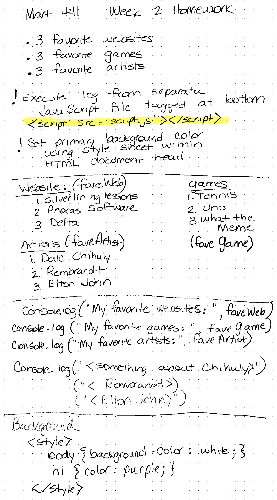

# MART 441Week2Homework
---
Base URL for site: [https://github.com/christinebmartin/MART441_Spring23] 
I spent a good part of my time refreshing my memory on what was covered in MART341.  
The Grasshopper site is a great learning tool!  I've used it in the past and find it to be very helpful.  I also downloaded the Codeacademy App on my phone which is has also been a good way to refresh skills. 
I created variables where the list arrays were contained. 
I then combined a heading to the variables.
Lastly, I added commentary on favorite artists. 
I'm still a bit confused as to why something would be written to the Log, but I'm sure this will become more evident as we work through things. 
Including my planning page for Homework 2 

